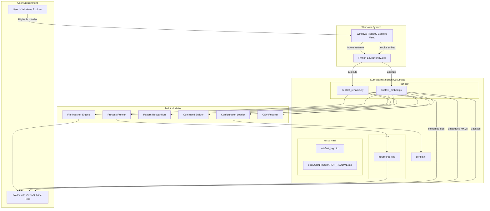

# High Level Architecture

## Technical Summary

SubFast v3.0.0 employs a straightforward **standalone script architecture** optimized for local file system operations on Windows. The system consists of two independent Python scripts (`subfast_rename.py` and `subfast_embed.py`) that are invoked via Windows Explorer context menu through Registry integration.

Both scripts share a common architectural pattern: directory scanning → intelligent file matching → batch processing → optional CSV reporting. The renaming script operates entirely in Python with sophisticated regex-based pattern matching, while the embedding script orchestrates subprocess calls to the external `mkvmerge.exe` tool.

The architecture prioritizes **performance through caching** (episode number lookups), **safety through atomic operations** (backup before modification), and **usability through Windows integration** (right-click access). There is no network communication, no persistent state beyond file system changes, and no background services - each script execution is a complete, self-contained operation.

This design achieves the PRD goals of simplicity (no GUI or CLI knowledge needed), performance (1000+ file processing in <1 second), and reliability (automatic backups, collision detection, comprehensive error handling).

## High Level Architecture Diagram

## Repository Structure

**Type:** Single Repository (Monorepo Not Applicable)

SubFast is a standalone utility with all components in a single directory structure:

- **Structure Type:** Simple directory-based organization
- **Version Control:** Git repository with linear structure
- **Package Management:** Not applicable (no multi-package monorepo)
- **Build Tool:** Not required (Python scripts executed directly)

## Architectural Patterns

**1. Command-Line Script Pattern**
- **Description:** Each feature implemented as independent command-line Python script invoked by Windows shell
- **Rationale:** Simplicity and direct Windows integration; no need for client-server architecture or persistent processes
- **Implementation:** Scripts accept folder path as argument and execute complete workflow in single run

**2. Modular Functional Design**
- **Description:** Scripts organized into distinct functions, each with single responsibility (load config, match files, process files, generate reports)
- **Rationale:** Maintainability and testability; clear separation of concerns enables focused unit testing and future enhancements
- **Implementation:** Pure functions for pattern matching; side-effect functions for I/O clearly separated

**3. Strategy Pattern for Language Detection**
- **Description:** Language code detection uses fallback chain: filename extraction → config fallback → none
- **Rationale:** Flexibility in handling various subtitle naming conventions while providing sensible defaults
- **Implementation:** Try filename pattern first; if no match, use config value; if config empty, proceed without language tag

**4. Facade Pattern for External Tool Integration**
- **Description:** Embedding script provides simple interface to complex `mkvmerge` command-line operations
- **Rationale:** Abstracts mkvmerge complexity from user; enables batch processing with consistent error handling
- **Implementation:** Command builder module constructs proper mkvmerge commands with list-based subprocess arguments

**5. Atomic Operation Pattern**
- **Description:** File operations structured as atomic transactions: backup → create temporary → verify success → finalize
- **Rationale:** Data safety and failure recovery; ensures no partial states even if operations fail mid-process
- **Implementation:** Embedding uses `.embedded.mkv` temporary files, only renamed to final name after successful mkvmerge completion

**6. Configuration-as-Code Pattern**
- **Description:** All user customization handled through INI configuration file with auto-generation of missing settings
- **Rationale:** User-friendly configuration without code modification; enables easy defaults and safe fallbacks
- **Implementation:** Config loader validates and provides defaults for all settings; invalid config triggers warnings but doesn't stop execution

---
