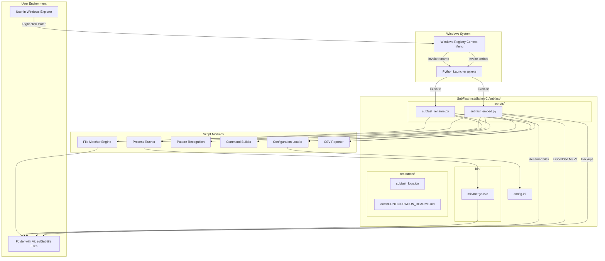
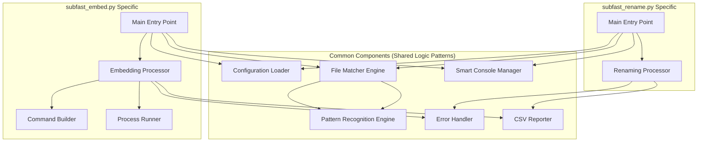
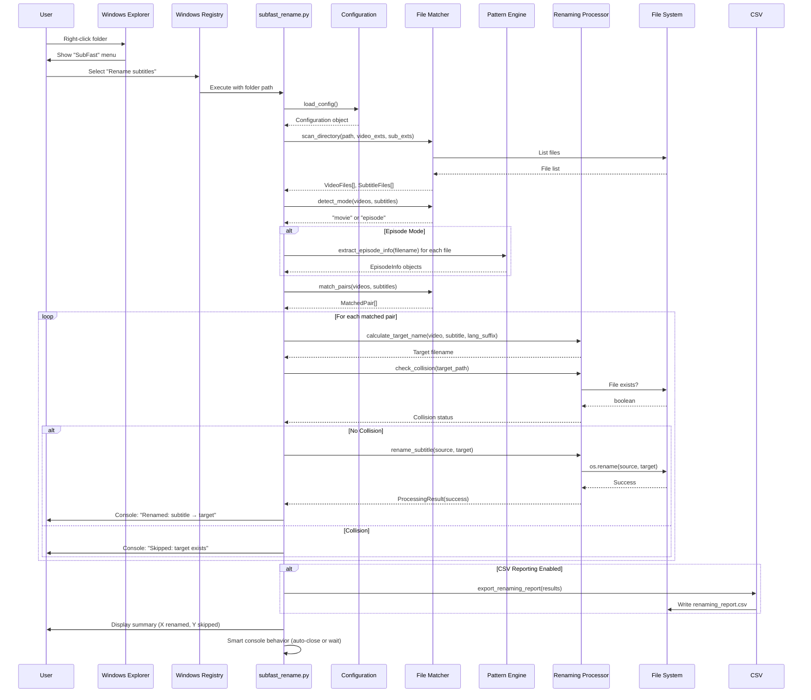
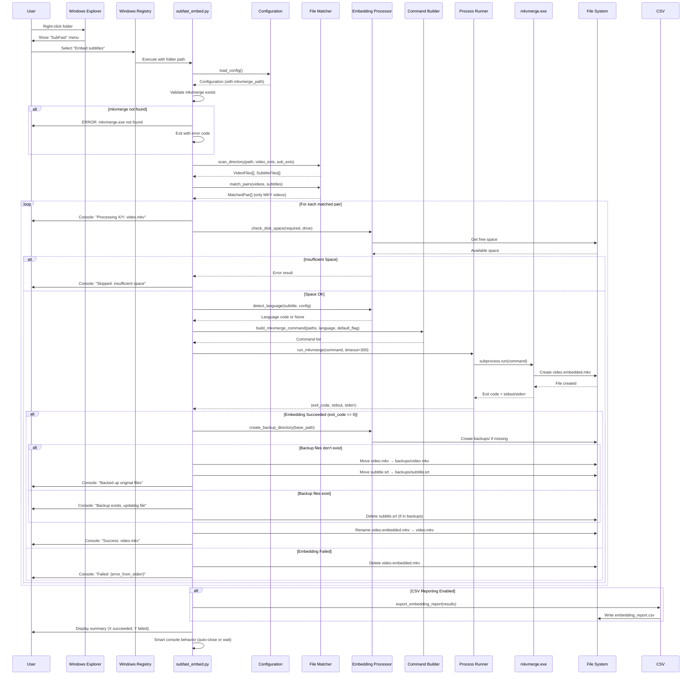

# SubFast Architecture Document

**Version:** 3.0.0  
**Last Updated:** January 2025  
**Product:** SubFast - Fast subtitle renaming and embedding for all languages

---

## Change Log

| Date | Version | Description | Author |
|------|---------|-------------|--------|
| January 2025 | 3.0.0 | Complete architecture rewrite for SubFast v3.0.0 dual-feature product | Architecture Team |
| October 2024 | 2.0.0 | Initial architecture for embedding feature addition | Architecture Team |

---

## Introduction

This document defines the complete architecture for SubFast v3.0.0, a Windows-based Python utility for automated subtitle management. SubFast provides two co-equal features:

1. **Subtitle Renaming**: Intelligent pattern-matching and automated renaming of subtitle files to match video filenames
2. **Subtitle Embedding**: Soft-subtitle embedding into MKV video files using mkvmerge integration

The architecture is designed for local execution on Windows 10/11 systems, prioritizing simplicity, performance, and reliability. SubFast operates as two standalone Python scripts integrated into Windows Explorer's context menu, requiring no server infrastructure, web interface, or complex deployment.

**Key Architectural Characteristics:**
- Standalone local execution (no client-server architecture)
- Windows-native integration via Registry
- Two independent but related command-line Python scripts
- Minimal dependencies (Python 3.7+, mkvmerge for embedding)
- File system-based operations with no database requirements
- Performance-optimized for batch processing (1000+ files in under 1 second for renaming)

**Starter Template:** N/A - Custom-built Windows utility

---

## High Level Architecture

### Technical Summary

SubFast v3.0.0 employs a straightforward **standalone script architecture** optimized for local file system operations on Windows. The system consists of two independent Python scripts (`subfast_rename.py` and `subfast_embed.py`) that are invoked via Windows Explorer context menu through Registry integration.

Both scripts share a common architectural pattern: directory scanning → intelligent file matching → batch processing → optional CSV reporting. The renaming script operates entirely in Python with sophisticated regex-based pattern matching, while the embedding script orchestrates subprocess calls to the external `mkvmerge.exe` tool.

The architecture prioritizes **performance through caching** (episode number lookups), **safety through atomic operations** (backup before modification), and **usability through Windows integration** (right-click access). There is no network communication, no persistent state beyond file system changes, and no background services - each script execution is a complete, self-contained operation.

This design achieves the PRD goals of simplicity (no GUI or CLI knowledge needed), performance (1000+ file processing in <1 second), and reliability (automatic backups, collision detection, comprehensive error handling).

### High Level Architecture Diagram



### Repository Structure

**Type:** Single Repository (Monorepo Not Applicable)

SubFast is a standalone utility with all components in a single directory structure:

- **Structure Type:** Simple directory-based organization
- **Version Control:** Git repository with linear structure
- **Package Management:** Not applicable (no multi-package monorepo)
- **Build Tool:** Not required (Python scripts executed directly)

### Architectural Patterns

**1. Command-Line Script Pattern**
- **Description:** Each feature implemented as independent command-line Python script invoked by Windows shell
- **Rationale:** Simplicity and direct Windows integration; no need for client-server architecture or persistent processes
- **Implementation:** Scripts accept folder path as argument and execute complete workflow in single run

**2. Modular Functional Design**
- **Description:** Scripts organized into distinct functions, each with single responsibility (load config, match files, process files, generate reports)
- **Rationale:** Maintainability and testability; clear separation of concerns enables focused unit testing and future enhancements
- **Implementation:** Pure functions for pattern matching; side-effect functions for I/O clearly separated

**3. Strategy Pattern for Language Detection**
- **Description:** Language code detection uses fallback chain: filename extraction → config fallback → none
- **Rationale:** Flexibility in handling various subtitle naming conventions while providing sensible defaults
- **Implementation:** Try filename pattern first; if no match, use config value; if config empty, proceed without language tag

**4. Facade Pattern for External Tool Integration**
- **Description:** Embedding script provides simple interface to complex `mkvmerge` command-line operations
- **Rationale:** Abstracts mkvmerge complexity from user; enables batch processing with consistent error handling
- **Implementation:** Command builder module constructs proper mkvmerge commands with list-based subprocess arguments

**5. Atomic Operation Pattern**
- **Description:** File operations structured as atomic transactions: backup → create temporary → verify success → finalize
- **Rationale:** Data safety and failure recovery; ensures no partial states even if operations fail mid-process
- **Implementation:** Embedding uses `.embedded.mkv` temporary files, only renamed to final name after successful mkvmerge completion

**6. Configuration-as-Code Pattern**
- **Description:** All user customization handled through INI configuration file with auto-generation of missing settings
- **Rationale:** User-friendly configuration without code modification; enables easy defaults and safe fallbacks
- **Implementation:** Config loader validates and provides defaults for all settings; invalid config triggers warnings but doesn't stop execution

---

## Tech Stack

### Core Technology Stack

| Category | Technology | Version | Purpose | Rationale |
|----------|-----------|---------|---------|-----------|
| **Primary Language** | Python | 3.7+ | Core scripting language | Strong file system libraries, subprocess management, regex support, and cross-platform potential |
| **Runtime** | Python Launcher | py.exe | Python script execution | Standard Windows Python launcher at `C:\Windows\py.exe` for .py file associations |
| **External Tool** | MKVToolNix (mkvmerge) | Latest Stable (bundled) | Matroska video muxing | Industry-standard tool for MKV manipulation; reliable soft-subtitle embedding |
| **Configuration Format** | INI File | config.ini | User configuration | Simple, human-readable format parsable by Python's `configparser` module |
| **OS Integration** | Windows Registry | .reg files | Context menu integration | Native Windows mechanism for shell extension without requiring COM DLL development |
| **File System Library** | Python pathlib | 3.7+ stdlib | Path operations | Modern, object-oriented path handling with Windows compatibility |
| **Subprocess Management** | Python subprocess | 3.7+ stdlib | mkvmerge execution | Standard library for safe external process invocation with list-based arguments |
| **Regex Engine** | Python re module | 3.7+ stdlib | Episode pattern matching | Built-in regex with compilation support for performance optimization |
| **CSV Export** | Python csv module | 3.7+ stdlib | Optional reporting | Standard library for Excel-compatible CSV generation |

### Development & Testing Tools

| Category | Technology | Version | Purpose | Rationale |
|----------|-----------|---------|---------|-----------|
| **Version Control** | Git | Any | Source control | Industry standard version control |
| **Testing Approach** | Manual + Unit Tests | Python unittest | Quality assurance | Manual testing for real-world validation; unit tests for critical pattern matching |
| **Code Editor** | Any Python IDE | - | Development | No specific IDE requirement |
| **Performance Profiling** | Python time module | stdlib | Execution timing | Built-in timing for performance metrics |

### Deployment & Distribution

| Category | Technology | Version | Purpose | Rationale |
|----------|-----------|---------|---------|-----------|
| **Package Format** | ZIP Archive | - | Distribution | Simple extraction to `C:\subfast\` |
| **Bundled Dependencies** | mkvmerge.exe | Latest | Embedded tool | Pre-bundled to eliminate user configuration complexity |
| **Installation** | Windows Registry | .reg files | Context menu setup | One-click installation via registry merge |

### Windows-Specific Considerations

**Python Launcher Requirement:**
- **Constraint:** Must be installed at `C:\Windows\py.exe`
- **Validation:** Scripts verify launcher existence at startup
- **Troubleshooting:** Clear error message if not found

**Registry Integration:**
- **Scope:** User-level or system-level (depending on admin rights)
- **Keys Modified:** `HKEY_CLASSES_ROOT\Directory\shell\SubFast`
- **Icon Support:** Uses `.ico` file for menu branding

**Subprocess Pattern:**
- **Critical:** Always use list-based arguments without `shell=True`
- **Reason:** Ensures compatibility with all Windows COMSPEC configurations
- **Example:** `subprocess.run([str(mkvmerge_path), '-o', str(output), ...])`

---

## Data Models

SubFast operates on file system objects without persistent data storage. The conceptual data models represent runtime structures used during processing.

### VideoFile

**Purpose:** Represents a video file discovered in the processing directory

**Attributes:**
- `path`: Path - Absolute path to video file
- `filename`: str - Base filename without extension
- `extension`: str - File extension (e.g., '.mkv', '.mp4')
- `episode_info`: Optional[EpisodeInfo] - Extracted episode information if detected
- `matched_subtitle`: Optional[SubtitleFile] - Associated subtitle file if match found

**Relationships:**
- One-to-zero-or-one with SubtitleFile (matched pair)

### SubtitleFile

**Purpose:** Represents a subtitle file discovered in the processing directory

**Attributes:**
- `path`: Path - Absolute path to subtitle file
- `filename`: str - Base filename without extension
- `extension`: str - File extension (e.g., '.srt', '.ass')
- `episode_info`: Optional[EpisodeInfo] - Extracted episode information if detected
- `detected_language`: Optional[str] - Language code extracted from filename
- `matched_video`: Optional[VideoFile] - Associated video file if match found

**Relationships:**
- One-to-zero-or-one with VideoFile (matched pair)

### EpisodeInfo

**Purpose:** Normalized episode identification extracted from filenames

**Attributes:**
- `season_number`: int - Normalized season number
- `episode_number`: int - Normalized episode number
- `pattern_matched`: str - Name of regex pattern that matched
- `raw_match`: str - Original matched string before normalization

**Example:**
```python
# "Show.S02E008.mkv" → EpisodeInfo(season=2, episode=8, pattern='S##E##', raw='S02E008')
# "Show.2x5.mkv" → EpisodeInfo(season=2, episode=5, pattern='##x##', raw='2x5')
```

### MatchedPair

**Purpose:** Validated video-subtitle pair ready for processing

**Attributes:**
- `video`: VideoFile
- `subtitle`: SubtitleFile
- `confidence`: str - Match confidence ('high' for episode match, 'movie' for single-pair)
- `target_name`: str - Calculated target filename for subtitle

**Operations:**
- Validates no filename collision before renaming
- Constructs complete target path with optional language suffix

### ProcessingResult

**Purpose:** Result of a single file operation (rename or embed)

**Attributes:**
- `source_video`: str - Original video filename
- `source_subtitle`: str - Original subtitle filename  
- `operation`: str - Operation type ('rename' or 'embed')
- `status`: str - Result status ('success', 'failed', 'skipped')
- `error_message`: Optional[str] - Error details if failed
- `execution_time`: float - Time taken in seconds

**Usage:**
- Collected for batch summary reporting
- Exported to CSV when reporting enabled

### Configuration

**Purpose:** Loaded and validated user configuration

**Attributes:**

**[General]**
- `detected_video_extensions`: List[str] - Video formats to process
- `detected_subtitle_extensions`: List[str] - Subtitle formats to process
- `keep_console_open`: bool - Console window behavior

**[Renaming]**
- `renaming_report`: bool - Enable CSV export for renaming
- `renaming_language_suffix`: str - Language suffix to append

**[Embedding]**
- `mkvmerge_path`: str - Path to mkvmerge.exe (resolved to absolute)
- `embedding_language_code`: str - Default language code for embedding
- `default_flag`: bool - Mark embedded subtitle as default track
- `embedding_report`: bool - Enable CSV export for embedding

**Validation:**
- Auto-generates missing config.ini with defaults
- Provides safe defaults for all invalid values
- Logs warnings for invalid settings

---

## Components

### 1. Configuration Loader

**Responsibility:** Load, validate, and provide configuration settings with safe defaults

**Key Interfaces:**
```python
def load_config(config_path: Path) -> Configuration:
    """Load config.ini or generate with defaults if missing"""
    
def validate_extensions(extensions: str) -> List[str]:
    """Parse and validate comma-separated extensions"""
    
def validate_boolean(value: str) -> bool:
    """Parse boolean configuration value"""
```

**Dependencies:**
- Python `configparser` module
- File system access for config.ini

**Technology Stack:**
- Python 3.7+ standard library
- INI file format parsing

**Implementation Notes:**
- Creates default config.ini if missing
- Never fails on invalid config (uses defaults with warnings)
- Validates all settings at startup before file processing

---

### 2. File Matcher Engine

**Responsibility:** Scan directories and identify matching video-subtitle pairs using pattern recognition

**Key Interfaces:**
```python
def scan_directory(path: Path, video_exts: List[str], sub_exts: List[str]) -> Tuple[List[VideoFile], List[SubtitleFile]]:
    """Discover all video and subtitle files in directory"""
    
def detect_mode(videos: List[VideoFile], subtitles: List[SubtitleFile]) -> str:
    """Determine if processing mode is 'movie' or 'episode'"""
    
def match_pairs(videos: List[VideoFile], subtitles: List[SubtitleFile]) -> List[MatchedPair]:
    """Match videos to subtitles using episode info or direct pairing"""
```

**Dependencies:**
- Configuration Loader (for extensions)
- Pattern Recognition Engine (for episode detection)
- File system access

**Technology Stack:**
- Python pathlib for file discovery
- Custom matching algorithm with episode number caching

**Implementation Notes:**
- Shared by both rename and embed scripts
- Uses dictionary caching for O(1) episode number lookups (12x performance gain)
- Case-insensitive file extension matching
- Deterministic processing order (sorted by filename)

---

### 3. Pattern Recognition Engine

**Responsibility:** Extract and normalize episode information from filenames using 25+ regex patterns

**Key Interfaces:**
```python
def compile_patterns() -> List[Tuple[str, re.Pattern]]:
    """Compile all regex patterns at script startup"""
    
def extract_episode_info(filename: str) -> Optional[EpisodeInfo]:
    """Try all patterns and return first match, normalized"""
    
def normalize_episode_number(raw: str) -> int:
    """Convert '05', '5', '005' all to integer 5"""
```

**Dependencies:**
- Python `re` module

**Technology Stack:**
- Python regex with compilation optimization
- Ordered pattern matching (most specific first)

**Pattern Categories:**
1. Standard: `S##E##`, `S##Ep##`
2. Alternate: `##x##` with resolution detection
3. Dash: `S## - ##`, `S## - E##`, `S## - EP##`
4. Text: `Season # Episode #`
5. Ordinal: `1st Season`, `2nd Season` + episode
6. Simple: `E##`, `Ep##`, `- ##`

**Implementation Notes:**
- Patterns compiled once at script initialization
- First matching pattern wins (order matters)
- Smart resolution detection prevents `1920x1080` false matches for `##x##`
- All episode numbers normalized to integers for comparison

---

### 4. Renaming Processor

**Responsibility:** Execute the renaming workflow for matched pairs with collision detection

**Key Interfaces:**
```python
def calculate_target_name(video: VideoFile, subtitle: SubtitleFile, language_suffix: str) -> str:
    """Generate target filename: {video_base}.{language_suffix}.{subtitle_ext}"""
    
def check_collision(target_path: Path) -> bool:
    """Return True if target file already exists"""
    
def rename_subtitle(source: Path, target: Path) -> ProcessingResult:
    """Perform atomic rename operation"""
```

**Dependencies:**
- File Matcher Engine
- Configuration Loader
- File system operations

**Technology Stack:**
- Python pathlib for atomic file operations
- Operating system file rename (atomic on NTFS)

**Implementation Notes:**
- No rename performed if collision detected
- Original files never modified on errors
- Real-time console progress reporting
- Maintains original subtitle extension

---

### 5. Embedding Processor

**Responsibility:** Orchestrate mkvmerge subprocess calls for subtitle embedding with backup management

**Key Interfaces:**
```python
def check_disk_space(required_bytes: int, target_drive: Path) -> bool:
    """Verify sufficient disk space before operation"""
    
def detect_language(subtitle: SubtitleFile, config: Configuration) -> Optional[str]:
    """Strategy: filename detection → config fallback → none"""
    
def create_backup_directory(base_path: Path) -> Path:
    """Create backups/ directory on first successful embed"""
    
def embed_subtitle(video: VideoFile, subtitle: SubtitleFile, config: Configuration) -> ProcessingResult:
    """Complete embedding workflow: validate → embed → backup → finalize"""
```

**Dependencies:**
- File Matcher Engine
- Command Builder
- Process Runner
- Configuration Loader

**Technology Stack:**
- Python subprocess with list-based arguments
- Python shutil for file operations
- mkvmerge.exe external dependency

**Workflow:**
1. Check disk space
2. Build mkvmerge command
3. Execute mkvmerge → `video.embedded.mkv`
4. On success: Create/use backups/, move originals, rename embedded
5. On failure: Delete `.embedded.mkv`, keep originals

**Implementation Notes:**
- Temporary `.embedded.mkv` prevents partial success states
- Backups created only after first successful operation
- Original files never deleted (moved to backups)
- Language detection tries filename patterns first

---

### 6. Command Builder

**Responsibility:** Construct safe, Windows-compatible mkvmerge command-line arguments

**Key Interfaces:**
```python
def build_mkvmerge_command(
    mkvmerge_path: Path,
    video: Path,
    subtitle: Path,
    output: Path,
    language: Optional[str],
    default_flag: bool
) -> List[str]:
    """Build list-based subprocess arguments for mkvmerge"""
```

**Dependencies:**
- Configuration Loader (for mkvmerge path)

**Technology Stack:**
- Python list construction for subprocess
- Explicit string conversion of Path objects

**Command Structure:**
```python
[
    str(mkvmerge_path),
    '-o', str(output_path),        # Output file
    str(video_path),                # Input video with all tracks
    '--language', f'0:{lang_code}', # Language tag if detected
    '--default-track', f'0:{yes|no}', # Default flag from config
    str(subtitle_path)              # Subtitle file to embed
]
```

**Critical Implementation Rule:**
```python
# CORRECT - Windows compatible
subprocess.run([str(mkvmerge), '-o', str(output), ...], ...)

# INCORRECT - May fail on non-standard COMSPEC
subprocess.run(f'{mkvmerge} -o {output} ...', shell=True)
```

**Rationale:**
- List-based arguments avoid shell parsing issues
- Works consistently regardless of Windows shell configuration
- Automatic proper quoting of paths with spaces
- No shell injection vulnerabilities

---

### 7. Process Runner

**Responsibility:** Execute mkvmerge subprocess with timeout, error capture, and exit code handling

**Key Interfaces:**
```python
def run_mkvmerge(command: List[str], timeout: int = 300) -> Tuple[int, str, str]:
    """Execute mkvmerge and return (exit_code, stdout, stderr)"""
    
def validate_output_file(output: Path, min_size: int) -> bool:
    """Verify mkvmerge created valid output file"""
```

**Dependencies:**
- Command Builder

**Technology Stack:**
- Python subprocess.run with capture
- Timeout enforcement (5 minutes default)

**Implementation Notes:**
- Captures stdout/stderr for error diagnosis
- Enforces timeout to prevent hanging
- Validates output file existence and size
- Returns structured results for error handling

---

### 8. CSV Reporter

**Responsibility:** Generate optional CSV reports of processing results for auditing

**Key Interfaces:**
```python
def export_renaming_report(results: List[ProcessingResult], output_path: Path):
    """Generate renaming_report.csv in processed directory"""
    
def export_embedding_report(results: List[ProcessingResult], output_path: Path):
    """Generate embedding_report.csv in processed directory"""
```

**Dependencies:**
- Configuration Loader (for report enable flags)

**Technology Stack:**
- Python csv module
- UTF-8 with BOM encoding for Excel compatibility

**CSV Formats:**

**Renaming Report:**
```csv
Original Filename,New Filename,Status,Timestamp,Execution Time
subtitle-05.srt,Show.S01E05.ar.srt,Success,2025-01-12T10:30:00,0.002
```

**Embedding Report:**
```csv
Original Video,Original Subtitle,Language Code,Status,Timestamp,Execution Time
video.mkv,subtitle.srt,ara,Success,2025-01-12T10:35:00,45.231
```

**Implementation Notes:**
- CSV generation optional (configurable)
- Overwrites previous report in same directory
- UTF-8 BOM for Excel auto-detection
- Timestamps in ISO 8601 format
- Execution time in seconds with millisecond precision

---

### 9. Error Handler

**Responsibility:** Centralized error handling, logging, and user-friendly error messages

**Key Interfaces:**
```python
def handle_config_error(error: Exception) -> Configuration:
    """Log warning and return default configuration"""
    
def handle_file_operation_error(operation: str, file_path: Path, error: Exception) -> ProcessingResult:
    """Log error and return failed result with message"""
    
def handle_mkvmerge_error(video: Path, exit_code: int, stderr: str) -> ProcessingResult:
    """Parse mkvmerge error and create user-friendly message"""
```

**Dependencies:**
- None (standalone utility module)

**Technology Stack:**
- Python exception handling
- Console output formatting

**Error Categories:**
1. **Configuration Errors:** Invalid config values (non-fatal, use defaults)
2. **File System Errors:** Permissions, disk space, missing files
3. **mkvmerge Errors:** Tool not found, execution failures, invalid files
4. **Pattern Matching Errors:** Unrecognized filename patterns (non-fatal)

**User Message Format:**
```
ERROR: [Category] - [Specific Issue]
File: [affected_filename]
Reason: [detailed_explanation]
Action: [suggested_fix]
```

**Example:**
```
ERROR: Disk Space - Insufficient space for embedding
File: LargeMovie.mkv
Reason: Required 5.2GB, available 2.1GB
Action: Free up disk space or process file on different drive
```

---

### 10. Smart Console Manager

**Responsibility:** Control console window behavior based on operation success/failure

**Key Interfaces:**
```python
def should_auto_close(config: Configuration, has_errors: bool) -> bool:
    """Determine if console should auto-close"""
    
def display_summary(results: List[ProcessingResult]):
    """Show batch processing summary before close"""
    
def wait_for_user_exit():
    """Display 'Press any key to continue...' and wait"""
```

**Dependencies:**
- Configuration Loader

**Technology Stack:**
- Python `input()` for keypress wait
- Python `time.sleep()` for auto-close delay

**Behavior Logic:**
```python
if config.keep_console_open:
    wait_for_user_exit()
elif has_errors:
    wait_for_user_exit()  # Keep open to review errors
else:
    display_summary()
    print("Operation completed successfully. Closing in 2 seconds...")
    time.sleep(2)
    # Auto-close
```

**Implementation Notes:**
- Errors always keep console open
- Success shows 2-second countdown before close
- Config override forces manual close
- Summary always displayed before any close

---

## Component Interaction Diagram

**Note:** This diagram shows logical components and their interactions. "Common Components" represent shared logic patterns that exist within both standalone scripts (`subfast_rename.py` and `subfast_embed.py`), not separate module files.



---

## Core Workflows

### Workflow 1: Subtitle Renaming



### Workflow 2: Subtitle Embedding



---

## Unified Project Structure

```plaintext
C:\subfast\                                    # Fixed installation path (required for registry)
├── scripts\                                   # Python scripts directory
│   ├── subfast_rename.py                     # Renaming feature script (standalone)
│   └── subfast_embed.py                      # Embedding feature script (standalone)
│
├── bin\                                       # Binary tools directory
│   └── mkvmerge.exe                          # Bundled MKVToolNix mkvmerge
│
├── resources\                                 # Resources directory
│   ├── subfast_logo.ico                      # Context menu icon
│   └── docs\                                 # Documentation
│       └── CONFIGURATION_README.md           # Detailed configuration guide
│
├── config.ini                                 # User configuration file
├── add_subfast_menu.reg                      # Registry installer
└── remove_subfast_menu.reg                   # Registry uninstaller

# Generated at runtime (in user directories):
<user_processing_directory>\
├── renaming_report.csv                       # Optional: Generated by rename script
├── embedding_report.csv                      # Optional: Generated by embed script
└── backups\                                  # Created by embed script on first success
    ├── original_video.mkv                    # Backed up original video
    └── original_subtitle.srt                 # Backed up original subtitle
```

### Directory Purpose:

**scripts/**
- Contains both standalone Python script executables
- Each script is self-contained with all necessary logic
- Directly executed by Python Launcher via Registry
- Shared logic (config loading, pattern matching, file operations) exists within each script

**bin/**
- Houses external binary dependencies (mkvmerge.exe)
- Allows bundled vs. user-provided tool flexibility
- Path configurable in config.ini

**resources/**
- Static assets: icons, documentation
- Separate from executable code for clarity
- Documentation accessible without code modification

**Root Level:**
- config.ini: Easy user access for configuration
- Registry files: Simple installation/uninstallation

**User Directories:**
- Reports generated in processed directory for easy access
- Backups created locally for safety and disk space management

---

## Development Workflow

### Local Development Setup

**Prerequisites:**
```bash
# Verify Python installation
py --version  # Should show Python 3.7 or higher

# Verify Python Launcher location
where py  # Should show C:\Windows\py.exe

# Install development tools (optional)
py -m pip install pytest  # For unit testing
```

**Initial Setup:**
```bash
# 1. Clone or extract project
cd C:\subfast\

# 2. Verify directory structure
dir  # Should show scripts/, bin/, resources/, config.ini

# 3. Test configuration loading
py scripts\subfast_rename.py --help  # Should show usage

# 4. Verify mkvmerge bundled correctly
bin\mkvmerge.exe --version  # Should show version info
```

### Manual Testing

**Test Renaming:**
```bash
# Create test directory with sample files
mkdir C:\temp\subfast_test
cd C:\temp\subfast_test

# Add test video: "Show.S01E05.mkv"
# Add test subtitle: "subtitle-05.srt"

# Run rename script directly
py C:\subfast\scripts\subfast_rename.py "C:\temp\subfast_test"

# Verify: subtitle-05.srt renamed to Show.S01E05.srt (or with language suffix)
```

**Test Embedding:**
```bash
# Using same test directory with MKV video and subtitle
py C:\subfast\scripts\subfast_embed.py "C:\temp\subfast_test"

# Verify: 
# - backups/ directory created
# - Original files moved to backups/
# - New Show.S01E05.mkv contains embedded subtitle
```

**Test Context Menu:**
```bash
# 1. Install context menu
# Double-click: add_subfast_menu.reg

# 2. Verify in Explorer
# Right-click in C:\temp\subfast_test
# Should see "SubFast" menu with two options

# 3. Test via context menu
# Right-click → SubFast → Rename subtitles
# Observe console window behavior
```

### Unit Testing

**Pattern Recognition Tests:**
```python
# tests/test_pattern_engine.py
import unittest
from scripts.common.pattern_engine import extract_episode_info

class TestPatternEngine(unittest.TestCase):
    def test_standard_format(self):
        result = extract_episode_info("Show.S01E05.mkv")
        self.assertEqual(result.season_number, 1)
        self.assertEqual(result.episode_number, 5)
    
    def test_alternate_format(self):
        result = extract_episode_info("Show.2x8.mkv")
        self.assertEqual(result.season_number, 2)
        self.assertEqual(result.episode_number, 8)
    
    def test_resolution_not_episode(self):
        result = extract_episode_info("Show.1920x1080.mkv")
        self.assertIsNone(result)
```

**Run Tests:**
```bash
py -m pytest tests/
```

### Configuration Testing

**Test Config Validation:**
```python
# Temporarily rename config.ini
# Run script - should auto-generate default config
py scripts\subfast_rename.py "C:\temp\test"

# Verify config.ini created with default values
```

**Test Invalid Config:**
```python
# Edit config.ini with invalid values
# detected_video_extensions = @@@invalid@@@

# Run script - should log warning and use defaults
py scripts\subfast_rename.py "C:\temp\test"
```

---

## Deployment and Distribution

### Installation Process

**User Installation Steps:**

1. **Extract ZIP:**
   ```
   User downloads SubFast-v3.0.0.zip
   Extract to C:\subfast\
   ```

2. **Verify Structure:**
   ```
   Ensure exact path: C:\subfast\
   Required files:
   - scripts\subfast_rename.py
   - scripts\subfast_embed.py
   - bin\mkvmerge.exe
   - config.ini
   - add_subfast_menu.reg
   ```

3. **Install Context Menu:**
   ```
   Double-click: add_subfast_menu.reg
   Click "Yes" when prompted
   Approve UAC if requested
   ```

4. **Verify Installation:**
   ```
   Right-click in any folder
   Look for "SubFast" cascading menu
   Should show: Rename subtitles, Embed subtitles
   ```

### Distribution Variants

**1. Standard Package:**
- Default config.ini (no language suffix)
- Latest mkvmerge.exe bundled
- Complete documentation
- For international users

**2. Arabic-Preconfigured Package:**
- config.ini with `renaming_language_suffix = ar`
- config.ini with `embedding_language_code = ara`
- Same mkvmerge.exe
- Arabic user guide included
- For Arabic subtitle management

### Uninstallation

**Steps:**
```bash
# 1. Remove context menu
Double-click: C:\subfast\remove_subfast_menu.reg

# 2. Verify removal
Right-click in folder → "SubFast" should be gone

# 3. Delete installation
Delete C:\subfast\ folder

# 4. Clean up user data (optional)
# User-generated backups/ and CSV reports remain in user directories
# Delete manually if desired
```

### Update Process

**In-Place Update:**
```bash
# 1. Download new version
# 2. Extract to temporary location
# 3. Close any running SubFast operations
# 4. Copy new files to C:\subfast\ (overwrite old)
# 5. Preserve user config.ini or merge changes
# 6. Registry unchanged (no need to re-run .reg files)
```

**Clean Update (Recommended):**
```bash
# 1. Backup user config.ini
# 2. Run remove_subfast_menu.reg
# 3. Delete C:\subfast\
# 4. Extract new version to C:\subfast\
# 5. Restore/merge config.ini
# 6. Run add_subfast_menu.reg
```

---

## Security Considerations

### Input Validation

**File Path Validation:**
- All paths resolved to absolute paths using `pathlib.Path.resolve()`
- No path traversal vulnerabilities (operations scoped to provided directory)
- File extension validation against whitelist from config

**Configuration Validation:**
- All config values validated with safe defaults
- No arbitrary code execution from configuration
- Invalid values logged and replaced with defaults

**User Input:**
- No direct user input during execution (folder path from Explorer)
- Command-line arguments only used for directory path

### Subprocess Security

**mkvmerge Execution:**
```python
# SECURE: List-based arguments prevent injection
subprocess.run([str(mkvmerge), '-o', str(output), str(video), str(subtitle)])

# INSECURE: Shell command concatenation (NOT USED)
subprocess.run(f'{mkvmerge} -o {output} {video} {subtitle}', shell=True)
```

**Security Measures:**
- Never use `shell=True`
- All paths explicitly converted to strings
- No user-controllable command construction
- mkvmerge path validated at startup
- Timeout enforced to prevent hanging processes

### File System Security

**Permissions:**
- Scripts run with user's Windows permissions
- No privilege escalation
- No modification of system files
- All operations in user-writable directories

**Backup Safety:**
- Original files moved (not deleted) to backups/
- Backup directory created in same location (no cross-drive issues)
- Collision detection prevents accidental overwrites

**Data Integrity:**
- Atomic file operations (rename complete or not at all)
- Temporary files (`.embedded.mkv`) deleted on failure
- No partial file states

### Privacy

**No External Communication:**
- No network requests
- No telemetry or analytics
- No data sent to external servers
- Completely offline operation

**Local Data Only:**
- All processing local to user's machine
- CSV reports stored locally
- No cloud storage or syncing

### Registry Integration Security

**User-Level Registry:**
- Context menu registered in user scope when possible
- No system-wide changes unless run as administrator
- Registry keys limited to Windows Explorer context menu

**Registry Content:**
```reg
; Only modifies Explorer context menu for folders
[HKEY_CLASSES_ROOT\Directory\shell\SubFast]
; No script execution paths in registry (uses .py association)
```

---

## Error Handling Strategy

### Error Categories and Responses

#### 1. Configuration Errors

**Type:** Non-Fatal (Use Defaults)

**Examples:**
- Missing config.ini
- Invalid file extensions
- Invalid boolean values
- Malformed INI syntax

**Handling:**
```python
try:
    config = load_config('config.ini')
except FileNotFoundError:
    logger.warning("config.ini not found. Generating default configuration.")
    config = generate_default_config()
    save_config(config)
except ConfigParseError as e:
    logger.warning(f"Invalid config.ini: {e}. Using defaults.")
    config = get_default_config()
```

**User Experience:**
- Console warning logged
- Default values used
- Script continues execution
- Default config.ini auto-generated if missing

---

#### 2. File System Errors

**Type:** Per-File Fatal (Skip File, Continue Batch)

**Examples:**
- Permission denied
- Disk full
- File in use by another process
- Invalid filename characters

**Handling:**
```python
for matched_pair in matched_pairs:
    try:
        result = process_file(matched_pair)
    except PermissionError as e:
        logger.error(f"Permission denied: {matched_pair.video.path}")
        result = ProcessingResult(status='failed', error=str(e))
    except OSError as e:
        logger.error(f"File system error: {e}")
        result = ProcessingResult(status='failed', error=str(e))
    
    results.append(result)
    # Continue with next file
```

**User Experience:**
- Error logged to console with affected file
- File skipped
- Batch processing continues
- Error included in summary and CSV report
- Specific troubleshooting hint provided

---

#### 3. mkvmerge Errors

**Type:** Per-File Fatal (Skip File, Continue Batch)

**Examples:**
- mkvmerge.exe not found
- Invalid MKV file
- Corrupted subtitle file
- mkvmerge crash
- Timeout (>5 minutes)

**Handling:**
```python
# At startup
if not mkvmerge_path.exists():
    console_error("mkvmerge.exe not found. Please check config.ini")
    sys.exit(3)

# During processing
try:
    exit_code, stdout, stderr = run_mkvmerge(command, timeout=300)
    if exit_code != 0:
        raise MKVMergeError(f"mkvmerge failed: {stderr}")
except subprocess.TimeoutExpired:
    logger.error(f"mkvmerge timeout (>5min) for {video.path}")
    result = ProcessingResult(status='failed', error='Timeout: Process took longer than 5 minutes')
except MKVMergeError as e:
    logger.error(f"mkvmerge error: {e}")
    result = ProcessingResult(status='failed', error=str(e))
```

**User Experience:**
- Startup validation prevents "tool not found" mid-batch
- Per-file errors logged with mkvmerge's stderr output
- Timeout prevents hanging on problematic files
- Failed files noted in summary
- Temporary `.embedded.mkv` cleaned up

---

#### 4. Pattern Matching Failures

**Type:** Non-Fatal (Skip File Pair)

**Examples:**
- Unrecognized filename pattern
- No matching video for subtitle
- Multiple possible matches (ambiguous)

**Handling:**
```python
episode_info = extract_episode_info(filename)
if episode_info is None:
    logger.info(f"Unrecognized pattern, skipping: {filename}")
    return None  # File not included in matched pairs

if len(potential_matches) > 1:
    logger.warning(f"Ambiguous match for {subtitle.path}: {potential_matches}")
    # Take first match and log warning
```

**User Experience:**
- Informational log (not error)
- File simply not processed
- No impact on other files
- Logged in summary: "X files processed, Y unmatched"

---

### Error Logging Format

**Console Output:**
```plaintext
[ERROR] <Category>: <Specific Issue>
File: <affected_filename>
Details: <error_details>
Suggestion: <troubleshooting_hint>
```

**Example:**
```plaintext
[ERROR] File System: Insufficient disk space for embedding
File: LargeMovie.mkv
Details: Required 5.2GB, available 2.1GB on drive C:\
Suggestion: Free up disk space or move file to drive with more space
```

**CSV Report Error Recording:**
```csv
Original Video,Original Subtitle,Status,Error Message,Timestamp
LargeMovie.mkv,LargeMovie.srt,Failed,"Insufficient disk space: Required 5.2GB, available 2.1GB",2025-01-12T10:45:00
```

### Exit Codes

```python
# Script exit codes for automation/scripting
EXIT_SUCCESS = 0          # All operations successful
EXIT_CONFIG_ERROR = 1     # Critical config issue (e.g., mkvmerge not found)
EXIT_FILE_ERROR = 2       # All files failed (permissions, disk full)
EXIT_MKVMERGE_ERROR = 3   # mkvmerge tool error (not found, invalid)
EXIT_USER_ABORT = 130     # User pressed Ctrl+C
```

---

## Performance Optimization

### Current Performance Metrics

**Renaming Performance:**
- **1000 files in <1 second** (v2.5.0 achievement)
- Episode number caching: 12x performance improvement over v2.0.0
- Regex compilation: Done once at startup
- CSV export disabled: +14% speed on large datasets

**Embedding Performance:**
- **Bottleneck:** mkvmerge execution time (seconds to minutes per file)
- **Disk I/O:** SSD significantly faster than HDD (10x+ improvement)
- **Parallelization:** Not implemented (risk of disk I/O contention)

### Optimization Strategies

#### 1. Regex Compilation (Renaming)

**Implementation:**
```python
# At script startup (done once)
COMPILED_PATTERNS = [
    ('S##E##', re.compile(r'S(\d{1,2})E(\d{1,3})', re.IGNORECASE)),
    ('##x##', re.compile(r'(\d{1,2})x(\d{1,3})', re.IGNORECASE)),
    # ... all 25+ patterns
]

# Per-file (fast lookup)
for pattern_name, pattern in COMPILED_PATTERNS:
    match = pattern.search(filename)
    if match:
        return normalize_episode(match)
```

**Benefit:** Avoids recompiling regex for each filename (1000x reduction in regex compile time)

---

#### 2. Episode Number Caching (Renaming)

**Implementation:**
```python
# Build cache: O(n) scan of all files
video_cache = {
    (season, episode): video_file 
    for video_file in videos 
    if video_file.episode_info
}

# Lookup: O(1) for each subtitle
for subtitle in subtitles:
    if subtitle.episode_info:
        season, episode = subtitle.episode_info
        matched_video = video_cache.get((season, episode))
```

**Benefit:** O(1) lookup instead of O(n) linear search per subtitle (12x speedup on 1000 files)

---

#### 3. CSV Export Optionality (Both Scripts)

**Configuration:**
```ini
[Renaming]
renaming_report = false  # Disable for 14% speed gain

[Embedding]
embedding_report = false  # Minimal impact (embedding is I/O bound)
```

**Benefit:** Eliminates CSV file I/O overhead for speed-critical scenarios

---

#### 4. Disk Space Pre-Check (Embedding)

**Implementation:**
```python
# Check once before processing
total_required = sum(video.size + subtitle.size for pair in matched_pairs)
available = shutil.disk_usage(base_path).free

if available < total_required * 1.1:  # 10% buffer
    console_error(f"Insufficient space: Need {total_required}, have {available}")
    sys.exit(2)
```

**Benefit:** Fails fast instead of mid-batch; prevents disk full errors during processing

---

#### 5. Memory Efficiency (Both Scripts)

**Sequential Processing:**
```python
# Good: Process files one at a time
for matched_pair in matched_pairs:
    result = process_file(matched_pair)
    results.append(result)

# Bad: Load all file contents in memory
file_contents = [open(f).read() for f in all_files]  # Memory bloat!
```

**Benefit:** Constant memory usage regardless of batch size (42% memory reduction in v2.5.0)

---

### Performance Testing

**Benchmark Setup:**
```bash
# Create test dataset
python generate_test_files.py --count 1000 --mode mixed

# Benchmark renaming
time py scripts\subfast_rename.py "C:\test_dataset"

# Benchmark embedding (smaller dataset due to time)
time py scripts\subfast_embed.py "C:\test_dataset_small"
```

**Key Metrics:**
- Total execution time
- Files processed per second
- Memory usage (via Windows Task Manager)
- CSV generation overhead (enabled vs disabled)

---

## Testing Strategy

### Testing Philosophy

**Approach:** Manual + Targeted Unit Tests

SubFast is a file-manipulation utility where automated end-to-end testing is complex (requires real video/subtitle files, Windows environment, Registry access). The strategy balances test coverage with practical development efficiency:

1. **Manual Testing:** Primary validation with real-world files
2. **Unit Tests:** Critical components (pattern matching, configuration)
3. **Integration Tests:** Limited scope (file operations with temp directories)
4. **Real-World Validation:** Beta testing with diverse media libraries

**Coverage Goals:**
- Pattern recognition: 100% (all 25+ patterns tested)
- Configuration loading: 100% (all valid and invalid cases)
- File operations: Manual verification
- mkvmerge integration: Manual verification
- Windows Registry: Manual verification

### Test Organization

```plaintext
C:\subfast\
├── tests\                                # Test directory
│   ├── __init__.py
│   ├── test_pattern_engine.py           # Pattern matching tests
│   ├── test_config_loader.py            # Configuration tests
│   ├── test_file_matcher.py             # File discovery and matching tests
│   ├── fixtures\                        # Test data
│   │   ├── sample_episodes.txt          # Filename examples
│   │   ├── test_config.ini              # Test configurations
│   │   └── test_videos\                 # Small test video files
│   └── manual_tests\                    # Manual test scenarios
│       ├── renaming_scenarios.md        # Test cases for renaming
│       └── embedding_scenarios.md       # Test cases for embedding
```

### Unit Tests

#### Pattern Recognition Tests

**Framework:** Python `unittest`

**Test Coverage:**
```python
# tests/test_pattern_engine.py
import unittest
from scripts.common.pattern_engine import extract_episode_info, normalize_episode_number

class TestPatternEngine(unittest.TestCase):
    """Test all 25+ episode patterns"""
    
    def test_standard_S##E##(self):
        self.assertEqual(extract_episode_info("Show.S01E05.mkv"), (1, 5))
        self.assertEqual(extract_episode_info("Show.S2E15.mkv"), (2, 15))
    
    def test_alternate_##x##(self):
        self.assertEqual(extract_episode_info("Show.2x8.mkv"), (2, 8))
        # Should NOT match resolution
        self.assertIsNone(extract_episode_info("Show.1920x1080.mkv"))
    
    def test_ordinal_seasons(self):
        self.assertEqual(extract_episode_info("Show.1st.Season.05.mkv"), (1, 5))
        self.assertEqual(extract_episode_info("Show.2nd.Season.E10.mkv"), (2, 10))
    
    def test_normalization(self):
        """Episode numbers should normalize regardless of padding"""
        self.assertEqual(extract_episode_info("Show.S01E05.mkv")[1], 5)
        self.assertEqual(extract_episode_info("Show.S1E5.mkv")[1], 5)
        self.assertEqual(extract_episode_info("Show.S01E005.mkv")[1], 5)
    
    def test_unrecognized_patterns(self):
        """Unrecognized patterns should return None"""
        self.assertIsNone(extract_episode_info("Random.File.Name.mkv"))
        self.assertIsNone(extract_episode_info("Movie.2023.BluRay.mkv"))

    # ... More tests for all pattern variations
```

**Run Tests:**
```bash
py -m unittest discover -s tests -p "test_*.py"
```

---

#### Configuration Tests

```python
# tests/test_config_loader.py
import unittest
import tempfile
from pathlib import Path
from scripts.common.config_loader import load_config, generate_default_config

class TestConfigLoader(unittest.TestCase):
    
    def setUp(self):
        """Create temporary config file for each test"""
        self.temp_dir = tempfile.mkdtemp()
        self.config_path = Path(self.temp_dir) / "config.ini"
    
    def test_missing_config_generates_default(self):
        """Missing config.ini should auto-generate"""
        config = load_config(self.config_path)
        self.assertTrue(self.config_path.exists())
        self.assertEqual(config.detected_video_extensions, ['mkv', 'mp4'])
    
    def test_invalid_extensions_use_default(self):
        """Invalid extensions should fallback to defaults"""
        self.config_path.write_text("""
        [General]
        detected_video_extensions = @@@invalid@@@
        """)
        config = load_config(self.config_path)
        self.assertEqual(config.detected_video_extensions, ['mkv', 'mp4'])
    
    def test_boolean_parsing(self):
        """Test various boolean value formats"""
        self.config_path.write_text("""
        [General]
        keep_console_open = true
        [Renaming]
        renaming_report = false
        """)
        config = load_config(self.config_path)
        self.assertTrue(config.keep_console_open)
        self.assertFalse(config.renaming_report)
    
    # ... More config validation tests
```

---

### Manual Testing Scenarios

#### Renaming Test Cases

**File:** `tests/manual_tests/renaming_scenarios.md`

**Test Scenarios:**

1. **Basic Episode Matching**
   - Setup: 3 videos `Show.S01E0{1,2,3}.mkv`, 3 subtitles `subtitle-{1,2,3}.srt`
   - Expected: Subtitles renamed to `Show.S01E0{1,2,3}.srt`

2. **Inconsistent Zero-Padding**
   - Setup: Video `Show.S2E8.mkv`, Subtitle `Show.S02E008.srt`
   - Expected: Context-aware match succeeds

3. **Language Suffix**
   - Setup: Config with `renaming_language_suffix = ar`
   - Expected: Renamed to `Show.S01E01.ar.srt`

4. **Collision Handling**
   - Setup: Target file already exists
   - Expected: Skip with warning, original untouched

5. **Movie Mode**
   - Setup: Single video + single subtitle
   - Expected: Direct 1:1 match without episode detection

6. **Unrecognized Patterns**
   - Setup: Video with standard pattern, subtitle with random name
   - Expected: No match, subtitle skipped

7. **CSV Report Verification**
   - Setup: Enable `renaming_report = true`
   - Expected: `renaming_report.csv` generated with accurate data

**Execution:**
```bash
# Create test directory, add files, run script, verify results
```

---

#### Embedding Test Cases

**File:** `tests/manual_tests/embedding_scenarios.md`

**Test Scenarios:**

1. **Basic Subtitle Embedding**
   - Setup: MKV video + matching subtitle
   - Expected: Subtitle embedded, backup created, original moved

2. **Language Detection from Filename**
   - Setup: Subtitle named `Show.S01E01.ar.srt`
   - Expected: Embedded with language code `ara`

3. **Language Fallback to Config**
   - Setup: No language in filename, config has `embedding_language_code = eng`
   - Expected: Embedded with `eng` language tag

4. **Default Track Flag**
   - Setup: `default_flag = true` in config
   - Expected: mkvmerge command includes `--default-track 0:yes`

5. **Disk Space Check**
   - Setup: Process large file with insufficient disk space
   - Expected: Skip with clear disk space error

6. **mkvmerge Failure**
   - Setup: Corrupted video file
   - Expected: Error logged, `.embedded.mkv` deleted, originals untouched

7. **Backup Collision**
   - Setup: Process same file twice
   - Expected: First creates backup, second skips backup and updates file

8. **Non-MKV Files**
   - Setup: MP4 video + subtitle
   - Expected: Skipped with message "Embedding only supports MKV"

9. **CSV Report Verification**
   - Setup: Enable `embedding_report = true`
   - Expected: `embedding_report.csv` with accurate language detection and timing

**Verification Tools:**
```bash
# Verify embedded subtitle
mkvmerge --identify output.mkv

# Verify subtitle track properties
mkvinfo output.mkv | grep -A5 "Track type: subtitles"
```

---

### Real-World Validation

**Beta Testing Checklist:**

1. **Diverse Episode Patterns**
   - Test with TV shows using different naming conventions
   - Verify all 25+ patterns work in practice

2. **Large Batch Processing**
   - Process 1000+ file dataset
   - Verify <1 second renaming performance
   - Monitor memory usage during embedding

3. **Various Subtitle Formats**
   - Test with .srt, .ass files
   - Different character encodings

4. **Different Video Formats**
   - Test with .mkv, .mp4 (renaming)
   - Verify MKV-only constraint (embedding)

5. **Windows Environment Variations**
   - Windows 10 and Windows 11
   - Different Python versions (3.7, 3.8, 3.10, 3.12)
   - User and Administrator accounts

6. **Edge Cases**
   - Files with special characters in names
   - Very long filenames
   - Unicode characters (Arabic, Chinese, etc.)

---

## Coding Standards

### Python Version and Compatibility

**Target:** Python 3.7+ (for Windows 10/11 compatibility)

**Rationale:** Python 3.7 is widely available and provides:
- `pathlib` for modern path handling
- f-strings for readable string formatting
- subprocess enhancements
- Type hints (optional use)

**Constraint:** No features from Python 3.8+ to maintain compatibility

---

### Code Style and Linting

**Style Guide:** PEP 8 (Python Enhancement Proposal 8)

**Linting:** Optional (not enforced via CI for simplicity)

**Key Conventions:**
- 4 spaces for indentation (no tabs)
- Max line length: 100 characters (flexible for readability)
- Snake_case for functions and variables
- PascalCase for classes
- UPPER_CASE for constants

---

### Critical Rules for AI Agents

These rules are MANDATORY for any AI agent modifying SubFast code:

#### 1. Subprocess Pattern

**Rule:** ALL subprocess calls MUST use list-based arguments without `shell=True`

**Correct:**
```python
subprocess.run(
    [str(mkvmerge_path), '-o', str(output), str(video), str(subtitle)],
    capture_output=True,
    text=True,
    timeout=300
)
```

**Incorrect:**
```python
# DO NOT USE - Shell injection risk and Windows compatibility issues
subprocess.run(f'{mkvmerge} -o {output} {video} {subtitle}', shell=True)
```

**Rationale:** List-based calls work reliably on all Windows shell configurations

---

#### 2. Path Handling

**Rule:** ALWAYS use `pathlib.Path` for file paths, NEVER string concatenation

**Correct:**
```python
from pathlib import Path

video_path = Path(directory) / "video.mkv"
backup_path = Path(directory) / "backups" / video_path.name
```

**Incorrect:**
```python
# DO NOT USE - Breaks on Windows with backslashes
video_path = directory + "/video.mkv"
```

**Rationale:** `pathlib` handles Windows vs. Unix path differences automatically

---

#### 3. Error Handling

**Rule:** File operations MUST have try-except blocks; batch processing MUST continue on individual failures

**Correct:**
```python
for matched_pair in matched_pairs:
    try:
        result = process_file(matched_pair)
    except (OSError, PermissionError) as e:
        logger.error(f"Failed to process {matched_pair.video.path}: {e}")
        result = ProcessingResult(status='failed', error=str(e))
    results.append(result)
    # Continue with next file
```

**Incorrect:**
```python
# DO NOT USE - One error stops entire batch
for matched_pair in matched_pairs:
    result = process_file(matched_pair)  # Unhandled exception halts all processing
```

**Rationale:** User expects partial success; one bad file shouldn't stop all processing

---

#### 4. Configuration Defaults

**Rule:** Missing or invalid config values MUST use safe defaults, NEVER fail

**Correct:**
```python
try:
    video_exts = config.get('General', 'detected_video_extensions', fallback='mkv, mp4')
except Exception:
    video_exts = 'mkv, mp4'
    logger.warning("Config error, using default video extensions")
```

**Incorrect:**
```python
# DO NOT USE - Crashes on invalid config
video_exts = config.get('General', 'detected_video_extensions')  # Raises if missing
```

**Rationale:** Tool should work out-of-the-box even with missing/corrupt config

---

#### 5. Logging vs. Printing

**Rule:** Use `print()` for user-facing console output; use `logger` for debugging (not implemented yet)

**Usage:**
```python
# User-facing messages
print("Processing file 3/10: ShowName.S01E03.mkv")
print("[ERROR] Disk space insufficient")

# Future: Debugging info (if logging implemented)
logger.debug(f"Matched episode S{season}E{episode}")
```

**Rationale:** Clean console output for users; logs for developers when debugging

---

#### 6. Atomic File Operations

**Rule:** Use temporary files for multi-step operations; finalize only on success

**Correct:**
```python
temp_output = video.parent / f"{video.stem}.embedded.mkv"
run_mkvmerge(command, output=temp_output)

if mkvmerge_succeeded:
    backup_original(video)
    temp_output.rename(video)  # Atomic rename
else:
    temp_output.unlink()  # Clean up failed temp file
```

**Incorrect:**
```python
# DO NOT USE - Overwrites original before verifying success
run_mkvmerge(command, output=video)  # Destroys original on failure!
```

**Rationale:** Prevents data loss if operation fails mid-process

---

### Naming Conventions

| Element | Convention | Example |
|---------|-----------|---------|
| Script files | snake_case | `subfast_rename.py` |
| Functions | snake_case | `load_config()`, `extract_episode_info()` |
| Classes | PascalCase | `VideoFile`, `EpisodeInfo` |
| Constants | UPPER_CASE | `DEFAULT_VIDEO_EXTENSIONS` |
| Private functions | _leading_underscore | `_validate_extension()` |
| Modules | snake_case | `config_loader.py`, `pattern_engine.py` |

---

### Documentation Standards

**Module Docstrings:**
```python
"""
Module: subfast_rename.py
Purpose: Intelligent subtitle renaming with pattern matching

This module implements the core renaming workflow: directory scanning,
episode pattern recognition, file matching, and safe renaming operations.
"""
```

**Function Docstrings:**
```python
def extract_episode_info(filename: str) -> Optional[EpisodeInfo]:
    """
    Extract normalized episode information from filename.
    
    Args:
        filename: Filename to parse (without path)
    
    Returns:
        EpisodeInfo if pattern matched, None otherwise
    
    Examples:
        >>> extract_episode_info("Show.S01E05.mkv")
        EpisodeInfo(season=1, episode=5, pattern='S##E##')
    """
```

---

## Monitoring and Maintenance

### Monitoring Capabilities

SubFast is a local utility without centralized monitoring infrastructure. Observability is achieved through:

#### 1. Console Output
- Real-time progress reporting during batch operations
- Success/failure status for each file
- Final summary statistics
- Error messages with affected filenames

#### 2. CSV Reports (Optional)
- Complete record of all operations
- Timestamps and execution times
- Status and error messages
- Useful for post-execution audit

#### 3. Windows Event Log (Not Implemented)
- Future consideration: Log critical errors to Windows Event Log
- Would enable centralized monitoring for IT administrators

### Maintenance Considerations

#### Pattern Updates

**Adding New Episode Patterns:**
```python
# In pattern_engine.py COMPILED_PATTERNS list
COMPILED_PATTERNS.append((
    'NewPattern',
    re.compile(r'YourRegexHere', re.IGNORECASE)
))
```

**Testing New Patterns:**
```python
# Add test case to tests/test_pattern_engine.py
def test_new_pattern(self):
    result = extract_episode_info("Example.NewFormat.mkv")
    self.assertEqual(result, (season, episode))
```

#### mkvmerge Updates

**Updating Bundled mkvmerge:**
1. Download latest MKVToolNix portable version
2. Extract `mkvmerge.exe` to `C:\subfast\bin\`
3. Test embedding workflow with sample files
4. Update version in README

**User-Provided mkvmerge:**
```ini
[Embedding]
# User can specify custom mkvmerge path
mkvmerge_path = C:\Program Files\MKVToolNix\mkvmerge.exe
```

#### Configuration Schema Evolution

**Adding New Config Options:**
```python
# In config_loader.py
def get_default_config():
    return {
        # Existing options...
        'new_option': 'default_value'  # Add new with default
    }
```

**Backward Compatibility:**
- Always provide defaults for new options
- Never remove existing options (deprecate if needed)
- Document changes in CHANGELOG.md

#### Python Version Migration

**Future Python 3.11+ Migration:**
- Update README requirements
- Test all subprocess calls (potential changes)
- Test Windows compatibility
- Consider new features (e.g., improved error messages)

### Known Limitations

1. **MKV-Only Embedding:** mkvmerge constraint, no MP4 support
2. **No Parallel Processing:** Sequential to avoid disk I/O contention
3. **Windows-Only:** Registry integration and `py.exe` dependency
4. **No GUI:** By design (context menu is the interface)
5. **No Undo:** Backups provide recovery, but no built-in undo

### Future Enhancement Ideas

1. **GUI Configuration Tool:** For users uncomfortable with INI files
2. **Batch Report Viewer:** HTML report instead of CSV
3. **Auto-Update Checker:** Check for new SubFast versions
4. **Pattern Suggestion:** Machine learning to suggest new patterns
5. **Multi-Language Subtitle Embedding:** Embed multiple subtitle tracks at once

---

## Next Steps

### For Development Team

**Immediate Actions:**
1. Implement pattern recognition unit tests
2. Create manual test scenarios documentation
3. Add comprehensive docstrings to all functions
4. Document shared logic patterns used within both scripts

**Future Enhancements:**
1. Consider migrating to Python logging module for better debugging
2. Evaluate need for Windows Event Log integration
3. Research parallel embedding for multi-core systems
4. Consider cross-platform support (Linux/macOS) in future version

### For Users

**Using This Document:**
1. Refer to "Core Workflows" for understanding system operation
2. Check "Error Handling Strategy" when troubleshooting issues
3. Review "Coding Standards" if contributing or modifying code
4. Use "Testing Strategy" for validating custom modifications

### For Architect

**This architecture is complete and production-ready.**

No additional architectural documents are required for SubFast as it has no:
- Frontend UI (no separate frontend architecture needed)
- Network API (no API specification needed)
- Cloud infrastructure (no IaC architecture needed)

All architectural concerns are covered in this unified document.

---

**End of Architecture Document**
