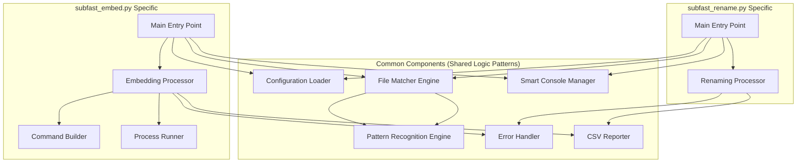

# Component Interaction Diagram

**Note:** This diagram shows logical components and their interactions. "Common Components" represent shared logic patterns that exist within both standalone scripts (`subfast_rename.py` and `subfast_embed.py`), not separate module files.

---
