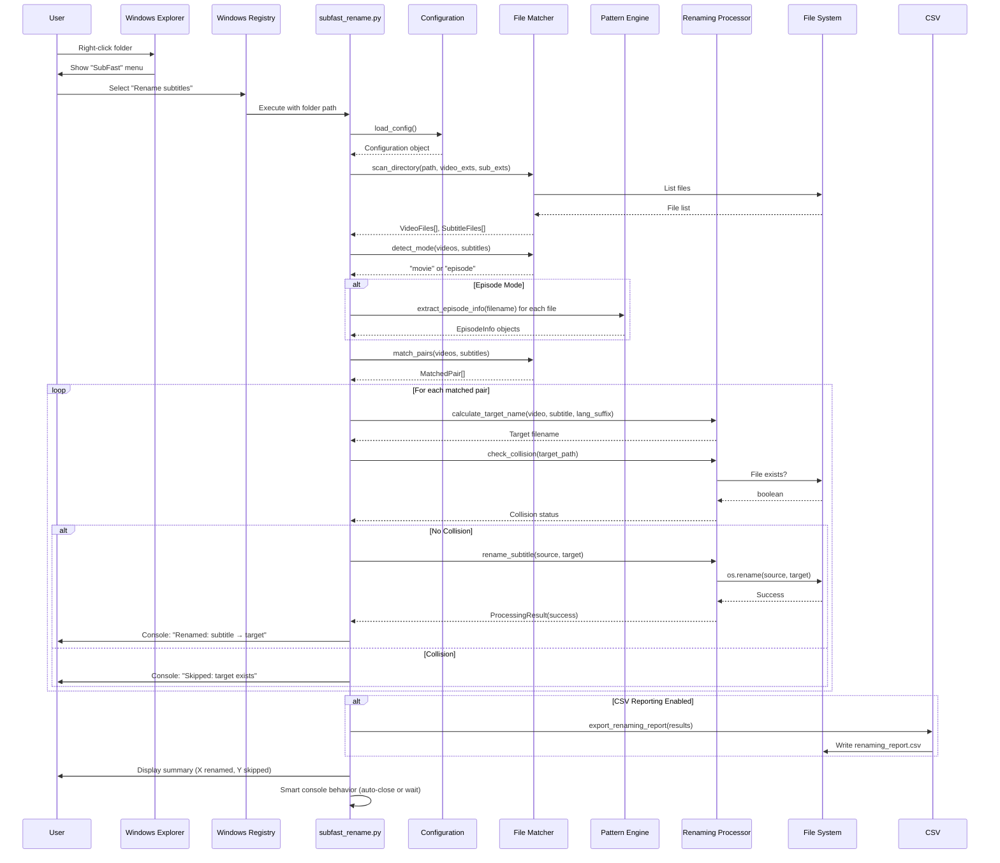
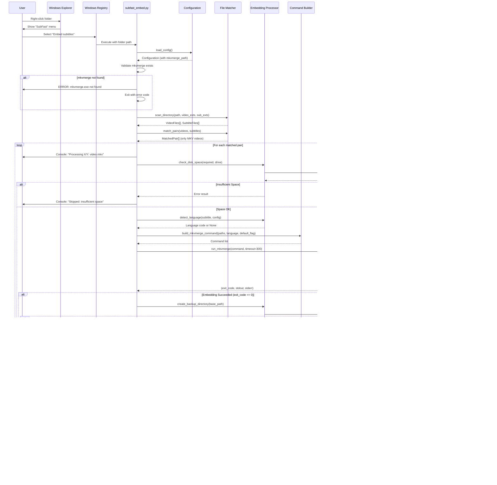

# Core Workflows

## Workflow 1: Subtitle Renaming

```mermaid
sequenceDiagram
    participant User
    participant WindowsExplorer as Windows Explorer
    participant Registry as Windows Registry
    participant Script as subfast_rename.py
    participant Config as Configuration
    participant Matcher as File Matcher
    participant Pattern as Pattern Engine
    participant Renamer as Renaming Processor
    participant FS as File System

    User->>WindowsExplorer: Right-click folder
    WindowsExplorer->>User: Show "SubFast" menu
    User->>Registry: Select "Rename subtitles"
    Registry->>Script: Execute with folder path
    
    Script->>Config: load_config()
    Config-->>Script: Configuration object
    
    Script->>Matcher: scan_directory(path, video_exts, sub_exts)
    Matcher->>FS: List files
    FS-->>Matcher: File list
    Matcher-->>Script: VideoFiles[], SubtitleFiles[]
    
    Script->>Matcher: detect_mode(videos, subtitles)
    Matcher-->>Script: "movie" or "episode"
    
    alt Episode Mode
        Script->>Pattern: extract_episode_info(filename) for each file
        Pattern-->>Script: EpisodeInfo objects
    end
    
    Script->>Matcher: match_pairs(videos, subtitles)
    Matcher-->>Script: MatchedPair[]
    
    loop For each matched pair
        Script->>Renamer: calculate_target_name(video, subtitle, lang_suffix)
        Renamer-->>Script: Target filename
        
        Script->>Renamer: check_collision(target_path)
        Renamer->>FS: File exists?
        FS-->>Renamer: boolean
        Renamer-->>Script: Collision status
        
        alt No Collision
            Script->>Renamer: rename_subtitle(source, target)
            Renamer->>FS: os.rename(source, target)
            FS-->>Renamer: Success
            Renamer-->>Script: ProcessingResult(success)
            Script->>User: Console: "Renamed: subtitle → target"
        else Collision
            Script->>User: Console: "Skipped: target exists"
        end
    end
    
    alt CSV Reporting Enabled
        Script->>CSV: export_renaming_report(results)
        CSV->>FS: Write renaming_report.csv
    end
    
    Script->>User: Display summary (X renamed, Y skipped)
    Script->>Script: Smart console behavior (auto-close or wait)
```

## Workflow 2: Subtitle Embedding

```mermaid
sequenceDiagram
    participant User
    participant WindowsExplorer as Windows Explorer
    participant Registry as Windows Registry
    participant Script as subfast_embed.py
    participant Config as Configuration
    participant Matcher as File Matcher
    participant Embedder as Embedding Processor
    participant Builder as Command Builder
    participant Runner as Process Runner
    participant MKVMerge as mkvmerge.exe
    participant FS as File System

    User->>WindowsExplorer: Right-click folder
    WindowsExplorer->>User: Show "SubFast" menu
    User->>Registry: Select "Embed subtitles"
    Registry->>Script: Execute with folder path
    
    Script->>Config: load_config()
    Config-->>Script: Configuration (with mkvmerge_path)
    
    Script->>Script: Validate mkvmerge exists
    alt mkvmerge not found
        Script->>User: ERROR: mkvmerge.exe not found
        Script->>Script: Exit with error code
    end
    
    Script->>Matcher: scan_directory(path, video_exts, sub_exts)
    Matcher-->>Script: VideoFiles[], SubtitleFiles[]
    
    Script->>Matcher: match_pairs(videos, subtitles)
    Matcher-->>Script: MatchedPair[] (only MKV videos)
    
    loop For each matched pair
        Script->>User: Console: "Processing X/Y: video.mkv"
        
        Script->>Embedder: check_disk_space(required, drive)
        Embedder->>FS: Get free space
        FS-->>Embedder: Available space
        
        alt Insufficient Space
            Embedder-->>Script: Error result
            Script->>User: Console: "Skipped: insufficient space"
        else Space OK
            Script->>Embedder: detect_language(subtitle, config)
            Embedder-->>Script: Language code or None
            
            Script->>Builder: build_mkvmerge_command(paths, language, default_flag)
            Builder-->>Script: Command list
            
            Script->>Runner: run_mkvmerge(command, timeout=300)
            Runner->>MKVMerge: subprocess.run(command)
            MKVMerge->>FS: Create video.embedded.mkv
            FS-->>MKVMerge: File created
            MKVMerge-->>Runner: Exit code + stdout/stderr
            Runner-->>Script: (exit_code, stdout, stderr)
            
            alt Embedding Succeeded (exit_code == 0)
                Script->>Embedder: create_backup_directory(base_path)
                Embedder->>FS: Create backups/ if missing
                
                alt Backup files don't exist
                    Script->>FS: Move video.mkv → backups/video.mkv
                    Script->>FS: Move subtitle.srt → backups/subtitle.srt
                    Script->>User: Console: "Backed up original files"
                else Backup files exist
                    Script->>User: Console: "Backup exists, updating file"
                    Script->>FS: Delete subtitle.srt (if in backups)
                end
                
                Script->>FS: Rename video.embedded.mkv → video.mkv
                Script->>User: Console: "Success: video.mkv"
            else Embedding Failed
                Script->>FS: Delete video.embedded.mkv
                Script->>User: Console: "Failed: {error_from_stderr}"
            end
        end
    end
    
    alt CSV Reporting Enabled
        Script->>CSV: export_embedding_report(results)
        CSV->>FS: Write embedding_report.csv
    end
    
    Script->>User: Display summary (X succeeded, Y failed)
    Script->>Script: Smart console behavior (auto-close or wait)
```

---
